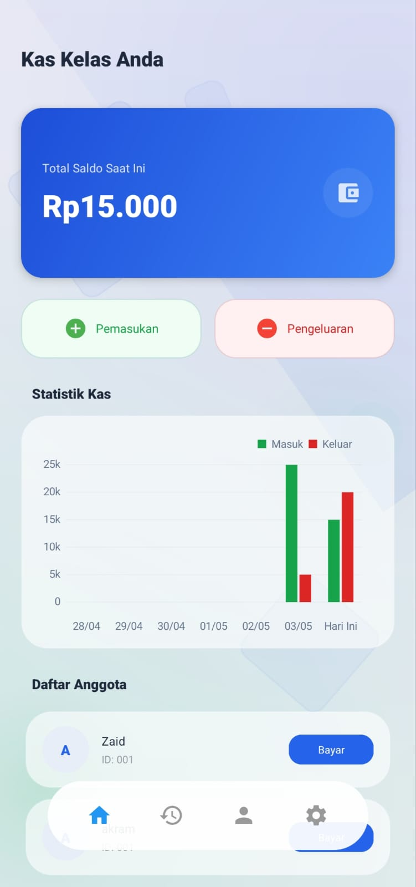
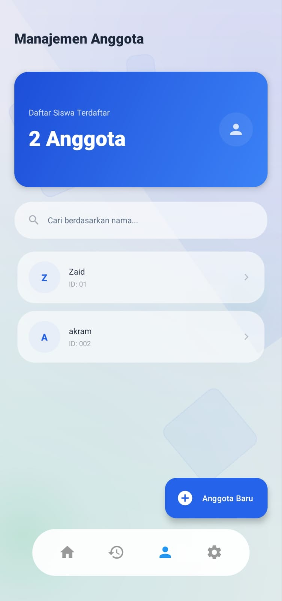

# KasKelas

KasKelas merupakan solusi aplikasi manajemen keuangan yang dirancang untuk membantu administrasi kas kelas atau organisasi secara sistematis dan transparan. Dengan fokus pada kemudahan penggunaan dan visualisasi data, aplikasi ini menjadi alat bantu yang efisien bagi bendahara dalam mengelola alur kas harian.

---

## Fitur Utama

*   **Dasbor Finansial Terpadu**: Pantau total saldo, ringkasan pemasukan, dan detail pengeluaran dalam satu antarmuka yang bersih.
*   **Analisis Visual Dinamis**: Integrasi grafik yang memudahkan pengguna dalam menganalisis tren keuangan kelas secara berkala.
*   **Sistem Manajemen Anggota**: Database terstruktur untuk mengelola data anggota serta status pembayaran iuran secara akurat.
*   **Arsip Riwayat Transaksi**: Dokumentasi seluruh transaksi keuangan yang memudahkan proses audit dan transparansi.
*   **Desain Antarmuka Premium**: Mengusung tema *Glassmorphism* dengan optimasi Dark Mode untuk kenyamanan visual maksimal.

---

## Panduan Instalasi

1.  **Unduh Aplikasi**: Kunjungi halaman [Releases](https://github.com/ZeroMysty/kaskelas/releases) dan unduh berkas APK versi terbaru.
2.  **Konfigurasi Keamanan**: Pastikan opsi "Instal aplikasi dari sumber tidak dikenal" telah diaktifkan pada pengaturan perangkat Android Anda.
3.  **Proses Instalasi**: Buka berkas APK yang telah diunduh dan ikuti instruksi yang muncul di layar.

---

## Informasi Teknis

*   **Bahasa Pemrograman**: Kotlin
*   **Manajemen Data**: Room Persistence Database
*   **Komponen UI**: Material Design 3, Constraint Layout
*   **Visualisasi Data**: MPAndroidChart
*   **Arsitektur**: Model-View-ViewModel (MVVM)

---

## Tampilan Aplikasi

| Dasbor Utama | Manajemen Anggota |
| :---: | :---: |
|  |  |

---

## Dokumentasi Tambahan

Informasi detail mengenai cara penggunaan aplikasi dapat diakses melalui berkas [Manual Book](manual_book.html) yang tersedia dalam paket distribusi aplikasi.

---

**Dikembangkan oleh [ZeroMysty](https://github.com/ZeroMysty)**
